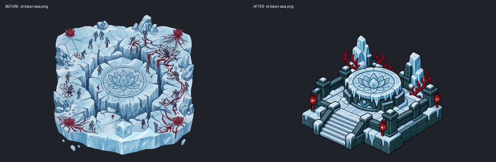
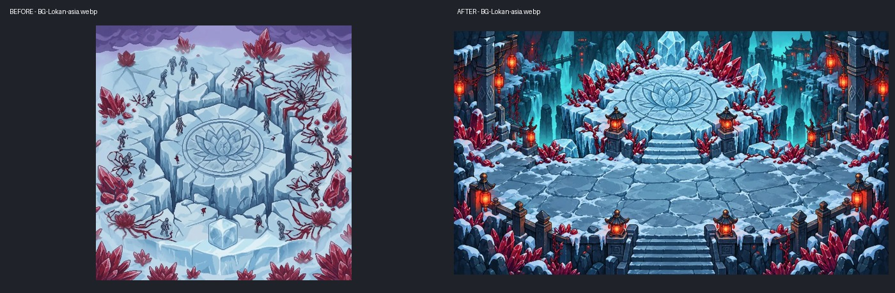
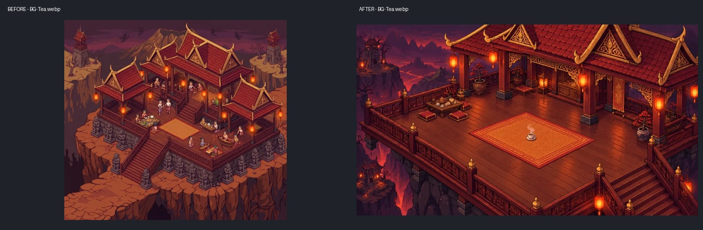
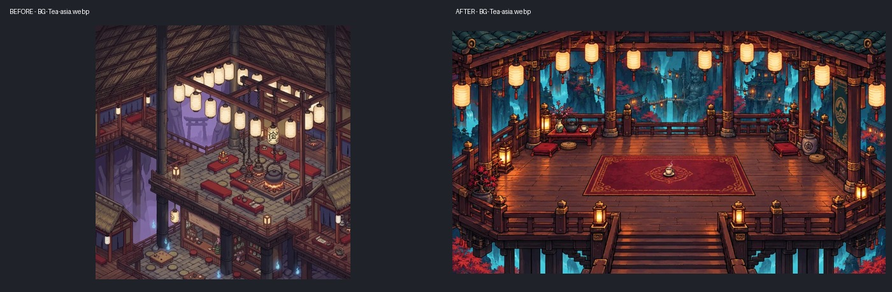
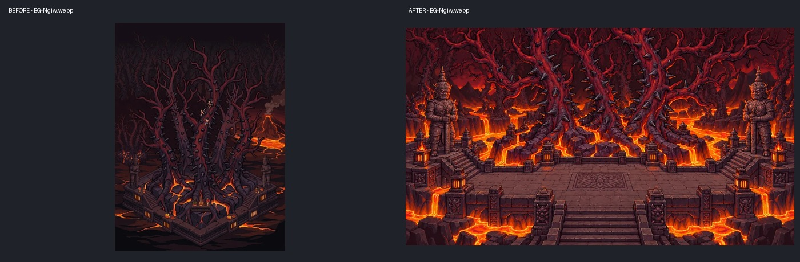
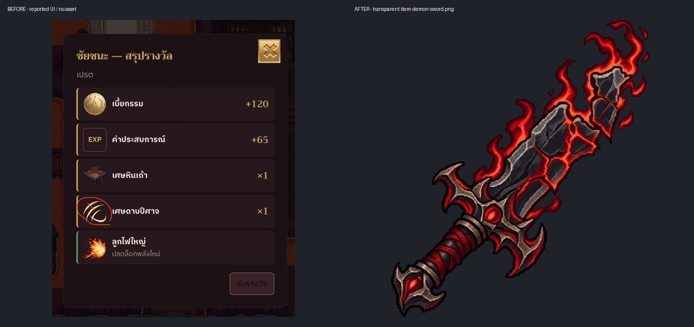
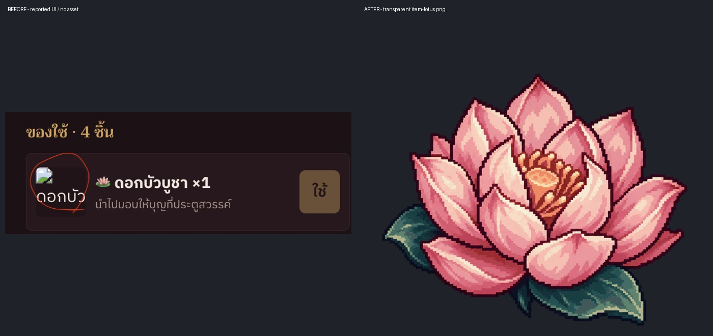

# AVEGEE 29D — ภาพสถานที่และไอคอน

ฐาน `main` / `e650294`; worktree `/Users/agapae/Documents/Work PAE/Claude/.codex-worktrees/20261003T094424Z-8b7b19ee`; branch `codex/20261003T094424Z-8b7b19ee`.

งานนี้เปลี่ยนเฉพาะภาพ, manifest และหลักฐานประกอบรายงาน ไม่มี commit / merge / push / deploy และไม่แก้ตรรกะ, hooks, status.json, worklog.json, Exam/, files/ หรือ CONCEPT.md

## หลักฐานอ้างอิงก่อนวาด

เปิดดูภาพจริง `img/Asia/st-sala-asia.png`, `st-krata-asia.png`, `st-tarang-asia.png`, `scene-asia-v2.png` เทียบมุมกล้องและสีของแท่นน้ำแข็ง; เปิดฉากเดิม `BG-Lokan-asia.webp`, `BG-Tea.webp`, `BG-Tea-asia.webp`, `BG-Ngiw.webp` และ `BG-Krata.webp`; เปิด `item-hypno.png`, `item-mirror.png` เทียบสไตล์ไอคอน

เปิดภาพ brief 01, 08, 14, 19 จาก `/Users/agapae/Documents/Work PAE/Claude/AGAPAE Agent/Output/Claudy/briefs/assets/29/` เทียบองค์ประกอบและปัญหาเดิม เปิด `intro-panel-01..05.webp`, `Asia/intro-zone2-asia.png`, `Asia/Intro-Boss-Zone2-asia.png` และ story panels จริงเทียบลักษณะพิกเซล/แสง ไม่พบคัตซีนที่ระบุชื่อเป็นศาลาน้ำชาโดยเฉพาะในฐานนี้ จึงอ้างสถาปัตยกรรมจากฉากชาเดิมและภาพ 08/19 ร่วมกับสไตล์คัตซีนของเกม; ห้ามนับว่าได้เทียบกับคัตซีนศาลาน้ำชาเฉพาะใบที่ยังไม่พบ

## ข้อจำกัดการรวมกับ 29B

ภาพภายในใหม่เป็นภาพแนวนอนเต็มใบ แต่ config เดิมยังวัดจากภาพเดิม: `roomFor()` เลือก `ROOMS.tea.ui4` / `ROOMS.ngiw.ui4` สำหรับโซนไทย และมี crop เดิม; `room.js` กลับภาพชาของโซนไทยเสมอ รวมทั้งวาด `item-tea` เพิ่มบนพื้น งาน 29D ไม่แก้สิ่งเหล่านี้เพราะใบงานอนุญาตเฉพาะภาพ/manifest

Dale ต้องตั้ง crop เป็น `null` หรือ `[0,0,1,1]` สำหรับภาพที่เปลี่ยน, ใส่พิกัดและ walk polygon ใหม่, ทำให้ฉากชาไทยแสดงทิศเดียวกับไฟล์ใหม่เพื่อให้บันไดอยู่ล่างขวา และเลือกการแสดงถ้วยเพียงชั้นเดียว เพราะถ้วยมีอยู่ในภาพแล้ว รายงานพิกัดด้านล่างวัดจากภาพเต็มก่อน crop/กลับภาพ; พิกัดเท้า ไม่ใช่ศูนย์กลางตัวละคร ยังคงต้องทดสอบเดินจริงหลังรวม 29B ไม่ได้อ้างว่า QA ผ่าน

## ดอกบัว (เงื่อนไข 29A)

ตอนเริ่มงานยังไม่พบรายงาน 29A จึงยังไม่วาดดอกบัว ต่อมาพบรายงาน `/Users/agapae/Documents/Work PAE/Claude/.codex-worktrees/20261003T094416Z-ba81ac59/output/Toby/2026-10-03-avegee-29a.md` บรรทัด 35 ซึ่งยืนยันว่าไม่พบไฟล์ดอกบัวใน `img/` และ path `img/item-lotus.png` ไม่มีจริง ตรงกับการตรวจชื่อไฟล์ในฐานนี้และ repo หลัก จึงสร้าง `img/item-lotus.png` ตามเงื่อนไข โดยไม่เรียก agent อื่นและไม่แก้ worktree 29A

## Prompt และวิธีเตรียมภาพ

ใช้ built-in `image_gen` หนึ่งคำขอต่อหนึ่งภาพพร้อม reference จริง; prompt เต็มอยู่ใน [29d/prompts.json](29d/prompts.json) ต้นฉบับ local อยู่ใต้ `img/raw/` (ignored) และสำเนาเดิมอยู่ใน [29d/before/](29d/before/) ใช้ฟังก์ชัน `prep()` จาก `scripts/prep-art.py` แยกตามชนิด BG / station / item เพื่อหลีกเลี่ยง `ingest()` ของ CLI ที่จะย้าย asset อื่นนอกขอบเขต ไม่แก้สคริปต์เตรียมภาพ

## ไฟล์ภาพและพิกัดสำหรับ Dale

ภาพสถานที่ 5 ไฟล์แทนชื่อเดิม จึงไม่ต้องสลับ path ในโค้ด; ไอคอน 2 ไฟล์เป็นชื่อที่ 29A รอใช้งานอยู่ ภาพภายในทั้ง 4 ใบเป็น 1024×576 (16:9) ไม่มีแถบดำในไฟล์ ส่วน PNG ทั้ง 3 ใบเป็น 512×512 พร้อม alpha จริง

| ไฟล์ | เนื้อภาพใหม่ | จุดถ้วย | จุดนั่งพัก/ลงมือ (เท้า) | จุดเกิด (เท้า) | ทางออก (เท้า) |
|---|---|---|---|---|---|
| `img/Asia/st-lokan-asia.png` | ฐานแท่นน้ำแข็งมุมสามส่วน เทียบศาลา/กระทะ/ตะราง | — | ใช้ไซต์แผนที่เดิม | — | — |
| `img/Asia/BG-Lokan-asia.webp` | แท่นบัวน้ำแข็งด้านหลัง ลานหินด้านหน้า | — | ลงมือ (50%, 62%) | (50%, 76%) | บันไดกลาง (50%, 92%) |
| `img/BG-Tea.webp` | ศาลาไทย พรมส้ม ถ้วยบนพื้น บันไดล่างขวา | (51%, 60%) | นั่งพัก (51%, 67%) | (63%, 73%) | (83%, 86%) |
| `img/Asia/BG-Tea-asia.webp` | ศาลาบูรพาชั้นเดียว พรมแดง โคมกระดาษ | (50%, 59%) | นั่งพัก (50%, 67%) | (50%, 76%) | บันไดกลาง (50%, 91%) |
| `img/BG-Ngiw.webp` | ต้นงิ้วหนาม ลาวา ยักษ์สองข้าง ลานหินแห้ง | — | ลงมือ (50%, 70%) | (50%, 77%) | บันไดกลาง (50%, 92%) |
| `img/item-demon-sword.png` | ดาบหักโลหะเข้ม ออร่าแดง | — | — | — | — |
| `img/item-lotus.png` | ดอกบัวบูชาสีชมพู ใบเขียว | — | — | — | — |

พิกัดวัดจากผลลัพธ์จริงหลัง prep ไม่ได้คัดตำแหน่งที่ขอใน prompt มาใช้ตรง ๆ พื้นที่เดินเสนอใน [29d/anchors.json](29d/anchors.json) เป็น % ของภาพ ใช้เฉพาะลาน/พื้นไม้/บันไดที่เห็นจริง ไม่รวมลาวา ช่องว่างรอบแท่น เสา หรือโต๊ะ จุดถ้วยแยกจากตำแหน่งเท้านั่ง เพื่อไม่ให้ตัวละครทับวัตถุ ต้องวัดเส้นขอบและขนาดสไปรท์อีกครั้งใน renderer หลังรวม 29B

ทางออกชาไทยเสนอให้เดินผ่านชานบันได `(76%,72%)` ก่อนลงถึง `(83%,86%)`; การตรวจเส้นตรงครั้งแรกพบว่าเส้นตัดขอบพื้นที่เดิน จึงแก้เป็นเส้นทางผ่านชาน ไม่ขยาย polygon ให้คลุมราวกั้น ภาพพิกัดประกอบ: [แท่นน้ำแข็ง](29d/lokan-asia-anchors.jpg), [ชาไทย](29d/tea-th-anchors.jpg), [ชาบูรพา](29d/tea-asia-anchors.jpg), [ดงต้นงิ้ว](29d/ngiw-th-anchors.jpg)

## ภาพก่อน/หลัง

ภาพคู่เหล่านี้แสดงไฟล์เต็มใบ ไม่มีการ crop เพื่อปิดบังสัดส่วนเดิม (ไม่ใช่ screenshot การรันเกมหลังรวม 29B)











ไอคอนก่อนทำไม่มีไฟล์ในฐานนี้ เปรียบเทียบกับหน้าจอปัญหาต้นทางในภาพคู่ด้านล่าง





## ผลตรวจและการตรวจเกณฑ์รับงาน

รันหลังภาพและ manifest ครบ:

```sh
node --test tests/construction-arrival.test.mjs tests/construction-art.test.mjs tests/construction-workers.test.mjs tests/room-ui4.test.mjs tests/scene-zones.test.mjs
git diff --check
```

- เทสต์ Node 26 ข้อ: pass 26 / fail 0 / skip 0, ประมาณ 22.7 วินาที ดู [tests.txt](29d/tests.txt) มี ExperimentalWarning ของ Node เกี่ยวกับ localStorage ตามชุดเดิม
- `construction-arrival.test.mjs`: 6 ข้อผ่าน ช่างทั้งสองคนทดสอบสร้าง/ซ่อมทุกสถานีทั้ง 4 โซน รวม 160 กรณี: 158 เดินถึง, 2 กรณีโซนไทย `lan` ใช้ recovery ตาม timeout เช่นเดียวกับก่อนเปลี่ยนภาพ; กรณี `asia/lokan` ไม่อยู่ในรายการ recovery เทสต์ตรวจจุดทำงานเดินได้และช่างไม่ถูกอาคารบัง ใช้ alpha ภาพใหม่และ manifest จริง
- เรียก `prep()` จาก `scripts/prep-art.py` สำหรับทั้ง 7 ภาพสำเร็จตามชนิด ดู [prep-art.txt](29d/prep-art.txt) BG เป็น WebP, station/item เป็น PNG; raw ไม่ถูกอ้างจากโค้ดเกมและไม่ได้แก้สคริปต์
- ตรวจไฟล์ด้วย Pillow: ฉาก 4 ใบเป็น 1024×576, ไม่มี row/column ที่ดำทั้งแนว; PNG 3 ใบเป็น RGBA 512×512, alpha min/max = 0/255, มุมทั้ง 4 โปร่งใส ดู [assets-check.txt](29d/assets-check.txt) พร้อมตรวจครบ 7 entries ใน manifest และกรอบ alpha ของแท่นใหม่ตรงกับพิกเซลจริง การตรวจนี้ไม่แทนการตัดสินความคมชัดด้วยสายตา; เปิดดูผลหลัง prep ครบทุกภาพแล้ว
- ตรวจ [anchors.json](29d/anchors.json) โดยใช้ `walkSegmentInside()` ของเกม: จุดถ้วย/เท้าอยู่ใน polygon เสนอ และเส้นทาง spawn → action/rest/exit ไม่ออกนอกพื้นที่นั้น ดู [anchors-check.txt](29d/anchors-check.txt) นี่เป็นการตรวจรูปทรงเสนอ ยังไม่ได้ใส่ config หรือเดินจริงในเกม
- manifest สร้างด้วย `scripts/make-manifest.py` แล้วคงข้อมูลเดิมนอก 29D (รวม custom fields เดิม) เหลือ diff เฉพาะเพิ่ม `item-demon-sword.png`, `item-lotus.png` และปรับ `boxes.st-lokan-asia` เป็น `[0,0.1465,1,1]`; `stationSizes.st-lokan-asia` ยังคง `[512,512]` ตรวจเทียบกับ HEAD แล้วว่าไม่มี metadata อื่นเปลี่ยน
- `git diff --check` ไม่มีข้อผิดพลาด ตรวจขอบเขต Git แล้วไม่มีไฟล์โค้ดหรือไฟล์ห้ามเปลี่ยน และ HEAD ยังเป็นฐานเดิม ไม่มี commit ใหม่

| เกณฑ์ | self-check และขอบเขตที่ยังต้องพิสูจน์ |
|---|---|
| 1. แท่นน้ำแข็ง map + interior + ช่างถึงไซต์ | ภาพใหม่มุมสามส่วนและฐานกะทัดรัดตามอาคารข้างเคียง ภายใน 16:9; arrival tests ผ่านโดยใช้ alpha ใหม่ ยังต้องดูสเกลจริงบนแผนที่และฉากใน renderer หลังรวม 29B |
| 2. ศาลาน้ำชา 2 โซน | ไฟล์แนวนอนเต็มใบ ถ้วยบนพื้นและบันไดตามที่ระบุ เปิดดูหลัง prep แล้ว; ยังไม่ยืนยันภาพเต็มจอ/จุดกดในเกมเพราะ config crop/กลับภาพเดิมไม่ได้แก้ และยังไม่พบคัตซีนเฉพาะศาลาน้ำชาให้เทียบ |
| 3. ดงต้นงิ้ว | วาดใหม่คมขึ้น รักษาต้นหนาม/ลาวา/ยักษ์สองข้าง ไม่มีปุ่มซ่อมฝังในภาพ; ปุ่ม runtime และ config อยู่ในงาน 29B |
| 4. ไอคอนดาบและดอกบัว | ทั้งสองเป็น PNG 512×512 alpha จริง อ้างสไตล์ item เดิม ดอกบัวทำหลังรายงาน 29A ยืนยันว่าไม่มี; การแสดงจริงในกระเป๋าต้องรวม 29A |
| 5. prep / manifest / tests / diff / ก่อนหลัง | prep ครบ 7, manifest ครบ, เทสต์ที่รัน 26 ข้อผ่าน, diff check ไม่มีข้อผิดพลาด, ภาพก่อน/หลังและ prompt ครบในรายงาน; ไม่ได้รันชุดเทสต์ทั้งหมดหรือทดสอบ browser/mobile และไม่อ้าง QA ผ่าน |

ไฟล์เปลี่ยน: ภาพ 7 ไฟล์ตามตาราง, `img/manifest.json`, รายงานนี้ และหลักฐานใต้ `Output/Toby/29d/` (before, ภาพคู่, ภาพพิกัด, prompts, anchors, logs) บน filesystem นี้ `Output/` และ `output/` เป็น path เดียวกัน; Git แสดงรายงานและหลักฐานเป็น `output/Toby/` ตามชื่อ directory เดิมของ repo
