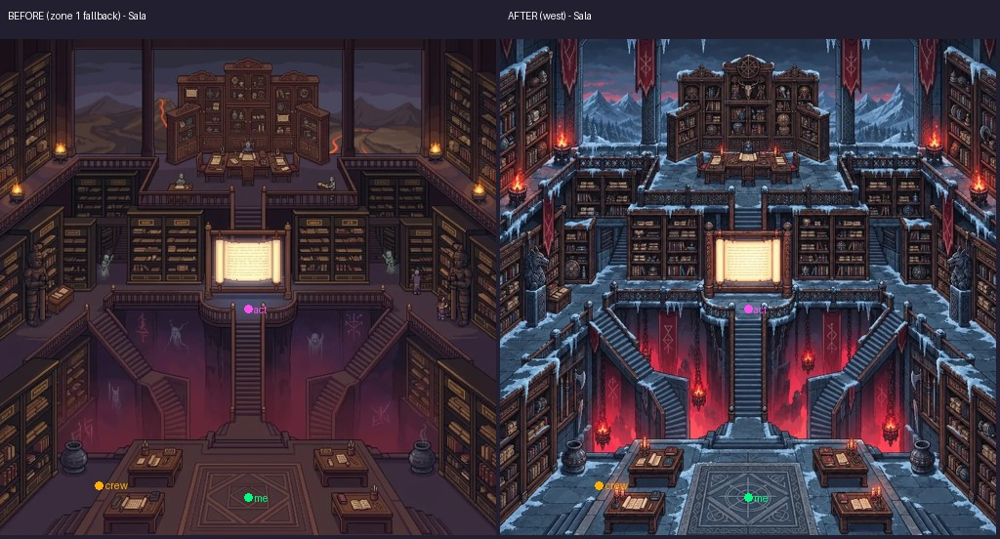
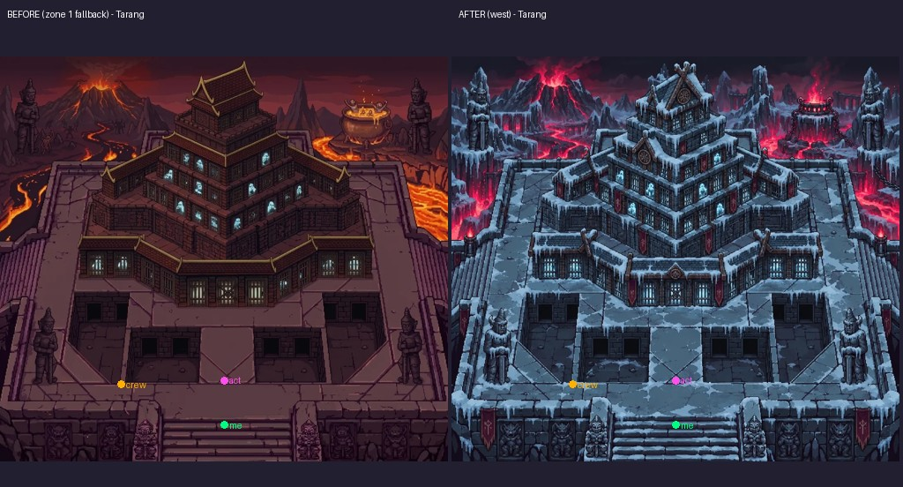
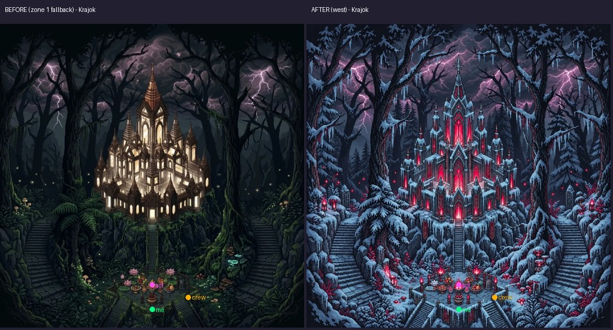
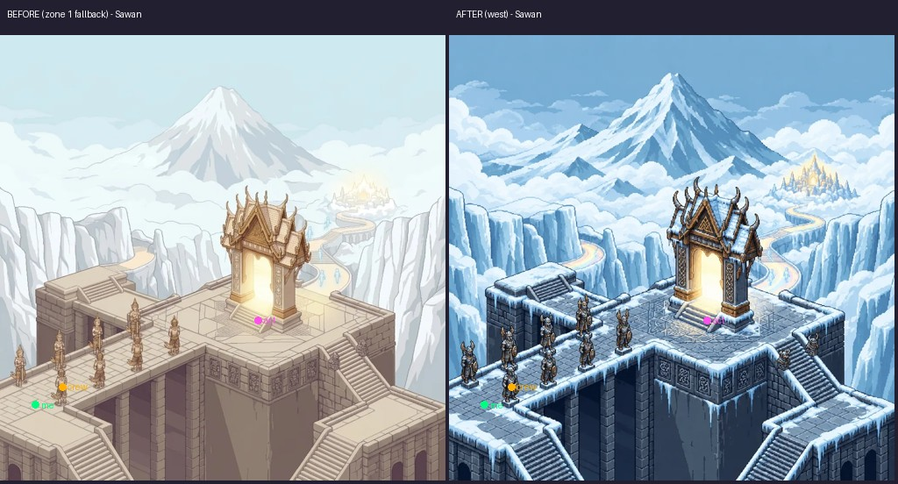
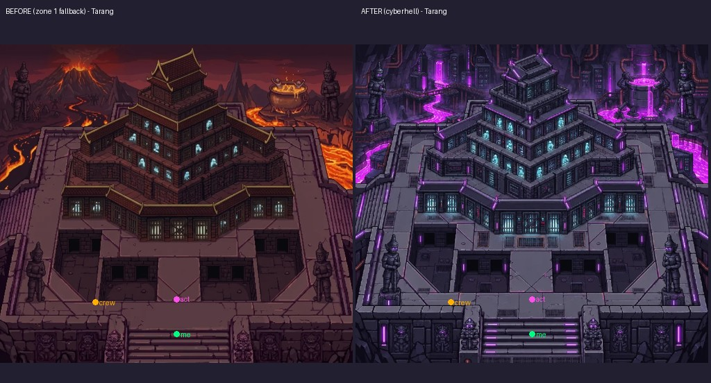
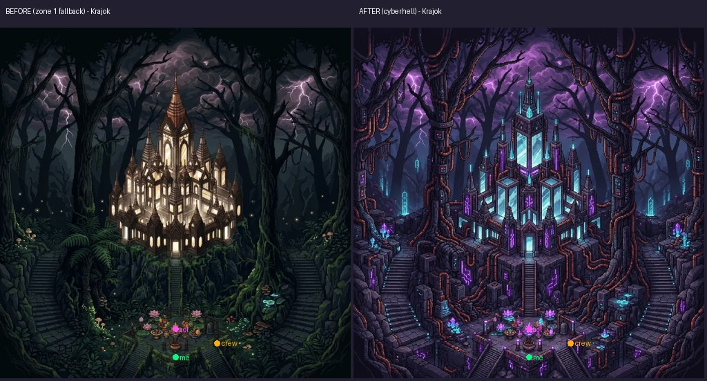
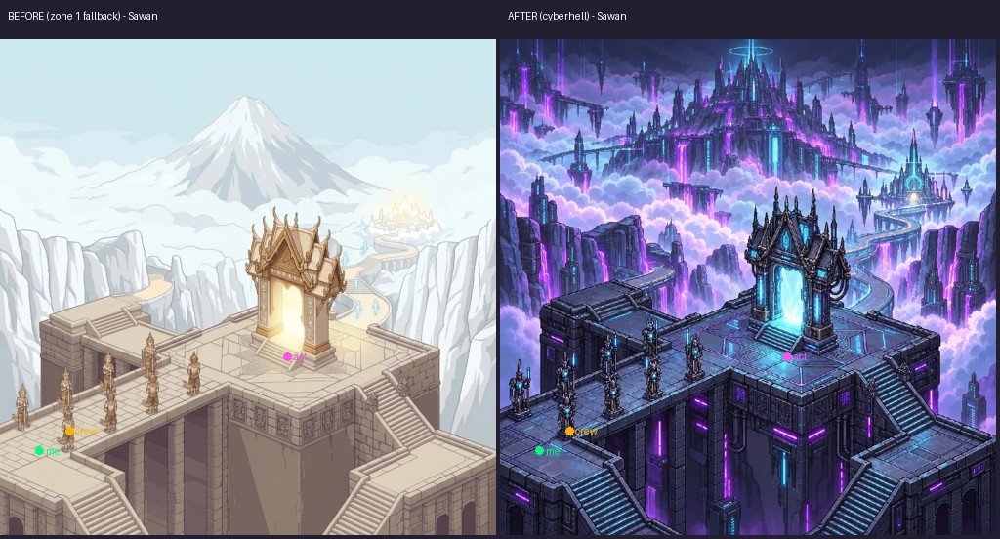
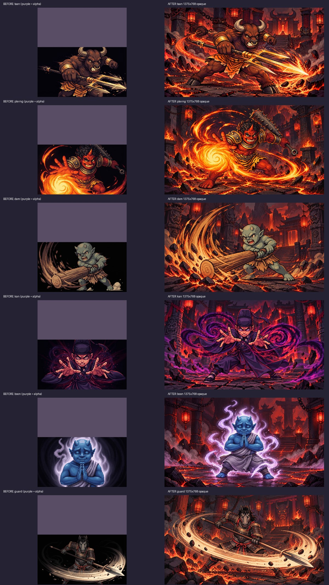
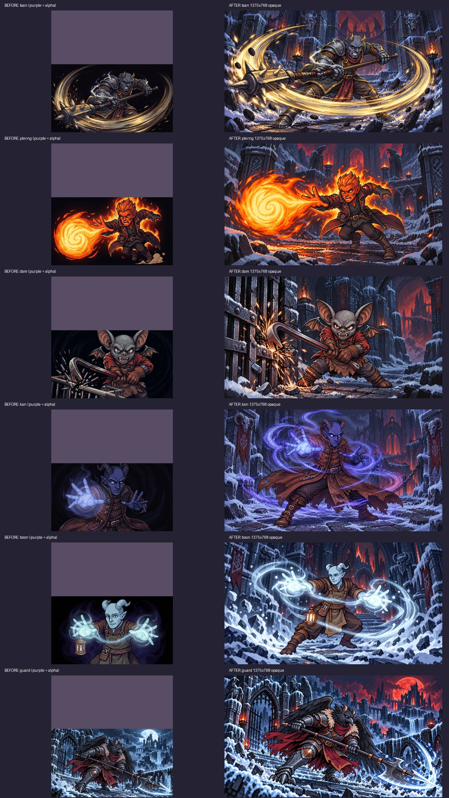
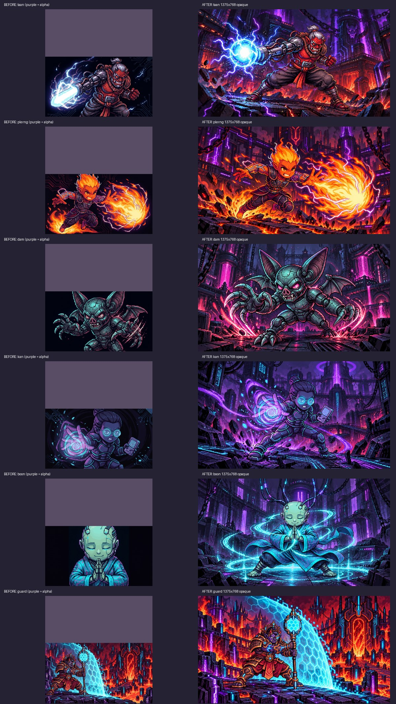

# AVEGEE — ใบงาน 29F (Codex image)

วันที่ 3 ต.ค. 2569 · ฐาน main `d3b0974bc57f80342c6b61dd7d0871626eaba0e0`
Worktree: `/Users/agapae/Documents/Work PAE/Claude/.codex-worktrees/20261003T143050Z-feb2dab7`
Branch: `codex/20261003T143050Z-feb2dab7` (worktree ที่จัดให้ แยกจาก main อยู่แล้ว)
ไม่ได้ commit / merge / push / deploy / เรียก agent อื่น

สร้าง asset ครบ: **ห้อง 7 ใบ + คัตซีน 18 ใบ** พร้อม path และ manifest มีผลทดสอบอัตโนมัติ แต่ **ยังไม่สรุปว่า QA ผ่าน** เพราะตรวจ gameplay ในเบราว์เซอร์ไม่ได้

## ไฟล์ที่ทำ

| ฉากใหม่ | ขนาด |
|---|---|
| `img/West/BG-Sala-west.webp` | 1024×1024 |
| `img/West/BG-Tarang-west.webp` | 1024×925 |
| `img/West/BG-Krajok-west.webp` | 1024×1024 |
| `img/West/BG-Sawan-west.webp` | 1024×1024 |
| `img/CyberHell/BG-Tarang-cyberhell.webp` | 1024×925 |
| `img/CyberHell/BG-Krajok-cyberhell.webp` | 1024×1024 |
| `img/CyberHell/BG-Sawan-cyberhell.webp` | 1024×1024 |

Sala-west ใช้ภาพจากรอบก่อนตาม brief ไม่วาดซ้ำ ต้นฉบับเป็นจัตุรัสตรงกับ BG-Sala โซน 1 อยู่แล้ว จึงไม่ต้องครอป ผ่าน prep ใหม่ก่อนบันทึก
Tarang โซน 1 เป็น 1081×976 ลดเป็นกว้าง 1024 สูง 925 (ปัดเศษสูงตามสัดส่วน) เก็บกรอบทั้งหมด ไม่ครอปทางเข้า/บันได
ภาพอื่นใช้ภาพโซน 1 ชื่อเดียวกันล็อกโครงฉาก และภาพ West/CyberHell ที่มีแล้วเป็นอ้างอิงสีและวัสดุ เปิดดูจริงก่อนวาด

คัตซีนใหม่ทั้งหมดเป็น **JPEG RGB 1375×768 (~16:9 ตามขนาดที่ brief ระบุ)**:

| ตัวละคร | โซน 2 | โซน 3 | โซน 4 |
|---|---|---|---|
| taan | `img/Asia/crew-taan-asia-cutscene.jpeg` | `img/West/crew-taan-west-cutscene.jpeg` | `img/CyberHell/crew-taan-cyberhell-cutscene.jpeg` |
| plerng | `img/Asia/crew-plerng-asia-cutscene.jpeg` | `img/West/crew-plerng-west-cutscene.jpeg` | `img/CyberHell/crew-plerng-cyberhell-cutscene.jpeg` |
| dam | `img/Asia/crew-dam-asia-cutscene.jpeg` | `img/West/crew-dam-west-cutscene.jpeg` | `img/CyberHell/crew-dam-cyberhell-cutscene.jpeg` |
| kan | `img/Asia/crew-kan-asia-cutscene.jpeg` | `img/West/crew-kan-west-cutscene.jpeg` | `img/CyberHell/crew-kan-cyberhell-cutscene.jpeg` |
| boon | `img/Asia/crew-boon-asia-cutscene.jpeg` | `img/West/crew-boon-west-cutscene.jpeg` | `img/CyberHell/crew-boon-cyberhell-cutscene.jpeg` |
| guard | `img/Asia/crew-guard-asia-cutscene.jpeg` | `img/West/crew-guard-west-cutscene.jpeg` | `img/CyberHell/crew-guard-cyberhell-cutscene.jpeg` |

แทนที่และลบ PNG เดิม 18 ไฟล์ตามรูปแบบ `img/<folder>/crew-<ตัวละคร>-<zone>-cutscene-<zone>.png` เพื่อไม่เหลือ asset คนละเวอร์ชันในเกม ภาพก่อนยังอ่านได้จากฐาน Git และภาพเปรียบเทียบในรายงาน
ตรวจหน้าตา/ท่า/อาวุธจาก PNG เดิมทั้ง 18 ใบและคัตซีนโซน 1 ก่อนวาดใหม่
Taan ไซเบอร์ปรับหนึ่งรอบ: ลำแสงเดิมชนขอบซ้าย เปลี่ยนเป็นก้อนพลังงานสั้นหน้าปืนอยู่ภายในกรอบ ตัวละครและฉากเดิมยังอยู่ครบ

ไฟล์อื่นที่แก้:

- `img/manifest.json`: ลงรายการห้อง 7 ใบและเปลี่ยน PNG เป็น JPEG 18 รายการด้วยการแก้เฉพาะข้อความ ไม่รัน make-manifest ไม่เปลี่ยน critical/rest/boxes/stationSizes
- `src/zone-introductions.js`: เปลี่ยนเฉพาะ URL คัตซีนเป็น `crew-${key}-${zone}-cutscene.jpeg` ไม่มีการเปลี่ยนตรรกะ
- `tests/zone-introductions.test.mjs`: อัปเดต path ที่คาดหวังเป็น JPEG
- `tests/battle-scale29c.test.mjs`: เปลี่ยน assertion ที่ยืนยันบั๊กเดิมว่าต้องมี ≥12 ใบครึ่งบนใส เป็นต้องไม่มีครึ่งบนใส ยังคงตรวจ contain ของคัตซีน 24 ใบ × 4 รูปทรงจอ
- `tests/room-cutscene29f.test.mjs`: เพิ่ม 3 เคส ตรวจ artUrl หลังโหลด manifest จริง, consumer คัตซีน, ไฟล์/ขนาด/ความทึบ
- `output/Toby/29f/`: prompt, บันทึกการสร้าง, ภาพก่อน/หลัง, log, สคริปต์ตรวจ Chromium ที่ยังรันไม่สำเร็จ
- รายงานนี้: `Output/Toby/2026-10-03-avegee-29f.md` (repo ใช้ชื่อโฟลเดอร์ `output`; filesystem นี้เข้าถึง `Output` ได้ด้วย)

## Prompt และ pipeline

ใช้ **built-in image_gen** ไม่ใช้ CLI/API fallback
[Prompt ชุดเดิมสำหรับห้อง](29f/prompts.json) · [Prompt คัตซีนทุกใบ แหล่งภาพ และ prompt แก้ Taan ไซเบอร์](29f/generation-records.json)

หลักของ prompt ห้อง: ภาพแรกเป็น composition target ภาพที่สองเป็น zone palette/material เท่านั้น คง camera/perspective/แพลตฟอร์ม/บันได/ประตู/โต๊ะตาม normalized coordinates เปลี่ยนวัสดุเป็น Norse/Gothic หรือนีออนม่วงฟ้า ไม่เพิ่ม UI ตัวละคร หรือ watermark
หลักของ prompt คัตซีน: คงตัวตนจากภาพโซนนั้น วาดองค์ประกอบใหม่เป็นภาพกว้างเต็มใบ พื้นทึบ ตัวเต็ม อาวุธครบ เผื่อขอบ 7% ใช้คัตซีนโซน 1 อ้างอิงเส้นพิกเซลและการจัดภาพ

นำภาพที่สร้างมา normalize ขนาดด้วย nearest-neighbor โดยไม่ครอป แล้วเรียกฟังก์ชัน `prep()` ของ `scripts/prep-art.py` ผ่าน importlib:
ห้องออก WEBP quality 82/method 6; คัตซีนออก JPEG quality 90
ไม่ได้เรียกสคริปต์เป็น CLI เพราะ `main()` จะเรียก ingest และ footer จะเรียก make-manifest อัตโนมัติ ซึ่งขัดกับ brief
ใช้ไฟล์พักใน temporary directory ไม่มีการเขียน `img/raw/`

[หลักฐาน prep](29f/prep-art.txt): รัน prep ซ้ำกับ input ที่ใช้จริงครบ 25 ใบใน temporary directory แล้วเทียบ bytes กับ output ใน img — ตรงกันทั้งหมด พร้อม SHA-256 รายไฟล์

## การตรวจที่รัน

| การตรวจ | ผลที่สังเกต |
|---|---|
| ฐานเดิม `node --test tests/*.test.mjs` | 270 เคสสำเร็จ / 0 ล้มเหลว |
| หลังแก้ `node --test tests/*.test.mjs` | 273 เคสสำเร็จ / 0 ล้มเหลว — [log](29f/tests.txt) |
| `node --check src/zone-introductions.js` และ `tests/room-cutscene29f.test.mjs` | exit 0 |
| import prep และเทียบ output ทั้ง 25 ใบ | bytes ตรงกัน 25/25 — [log](29f/prep-art.txt) |
| ตรวจ manifest ทุก critical/rest/zones | 518 references มีไฟล์จริงทั้งหมด ไม่มี path หาย |
| ตรวจขอบภาพจากไฟล์จริง | JPEG 18 ใบ RGB, alpha เมื่อแปลง RGBA เป็น 255 ทุกพิกเซล, ขนาด 1375×768 ทั้งหมด |
| contain regression ที่มีอยู่ | คัตซีน 24 ใบ × desktop/laptop/mobile/small ไม่เกินกรอบ และเต็มอย่างน้อยหนึ่งแกน |
| `git diff --check` | exit 0 ไม่มี whitespace error |
| เส้นทางต้องห้ามและ metadata | ไม่เปลี่ยน img/raw, Exam, files, CONCEPT.md, hooks, status.json, worklog.json — [scope](29f/scope-check.txt) |
| `python3 output/Toby/29f/verify-browser.py` | เปิด Chromium ไม่สำเร็จ: sandbox ปฏิเสธ MachPortRendezvous (`Permission denied (1100)`) — [log](29f/browser.txt) |

**ยังไม่ได้ทำ**: ตรวจการเดิน จุดเกิด จุดออก และปุ่มทั้ง 7 ห้องในเบราว์เซอร์จริง รวมถึงเล่นคัตซีนระหว่างต่อสู้จริง ภาพด้านล่างเป็นภาพ asset เปรียบเทียบ ไม่ใช่ screenshots จากเกม

ตรวจทางเลือก built-in browser แล้ว skill [built-in-browser SKILL.md](/Users/agapae/.agents/skills/synced/c76c41a5-1648-4c7c-aade-9fb1314b5a40_5e0bb1cf-be1e-41bc-8251-043ea5ae892b/built-in-browser/SKILL.md) ระบุว่า “The built-in browser cannot open `file://` URLs or `localhost` servers that Codex starts itself” จึงไม่ได้ใช้ทางนี้กับ local test server ไม่ได้ขอสิทธิ์เพิ่มหรือหลบ sandbox

## Self-check ตามเกณฑ์รับงาน

| # | เกณฑ์ | หลักฐาน / ข้อจำกัด |
|---|---|---|
| 1 | ห้อง 7 ฉากมีจริง เกมโหลดแทนโซน 1 สัดส่วนตรง | ไฟล์ครบ เทสต์ artUrl เลือก path ของ West/CyberHell ทั้ง 7 หลัง manifest มาถึง ขนาดตาม reference โดยปัดเศษ 1px ตรวจภาพพร้อม me/crew/act เดิมแล้ว โครงทางเดิน/บันไดคงเดิมในระดับภาพอ้างอิง **ยังต้องตรวจเดินและกดปุ่มจริง** |
| 2 | คัตซีนโซน 2–4 เต็ม 16:9 ทึบ ไม่ตกขอบ | ครบ 18 ใบ 1375×768 ทึบทุกพิกเซล ตรวจตัวเต็ม/อาวุธด้วยตาและ contain regression 4 รูปทรงจอ แก้ลำแสง Taan ไซเบอร์ **ยังไม่ได้ดูระหว่างเกมจริง** |
| 3 | prep, manifest, tests, diff check, ก่อน/หลัง | prep 25/25, manifest 518 references ไม่หาย, tests 273/0, diff check exit 0, ภาพก่อน/หลังครบด้านล่าง **browser check ถูก sandbox บล็อก จึงไม่สรุป QA ผ่าน** |

## ภาพก่อน/หลัง

จุดสีบนภาพห้อง: เขียว = me, ส้ม = crew, ชมพู = act (พิกัดเดิมจาก ROOMS)
คัตซีนก่อน: สีม่วงเรียบแสดงบริเวณ alpha เพื่อให้เห็นครึ่งบนที่หายไป

